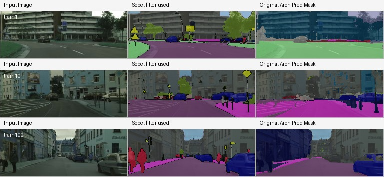

# Architectural Changes: Boundary-Aware EfficientSAM

## Overview
This folder documents and contains our architectural modification of EfficientSAM to explicitly model boundaries in addition to region segmentation.

The core motivation is to reduce overly smooth mask edges from the original decoder by adding a dedicated boundary prediction pathway and fusing it with the standard mask pathway.

## What We Changed (High Level)
Starting from EfficientSAM's original two-way transformer decoder, we introduced a boundary-aware decoding pipeline:

1. Keep the standard decoder feature extraction unchanged.
2. Split the shared decoder feature map into two branches:
- Original mask branch (region prediction).
- New boundary branch (edge prediction).
3. Learnably fuse mask and boundary predictions.
4. Train with a joint objective:
- Region/semantic segmentation loss.
- Boundary supervision loss from Sobel-derived ground-truth edges.

This keeps the architecture lightweight while making edges sharper and more explicit.

## Decoder Modification in Detail
### 1) Shared feature map from two-way transformer
As in original EfficientSAM, image embeddings + prompt embeddings are processed through the decoder transformer and upscaling path to produce a dense feature map.

### 2) New boundary head
We added a lightweight CNN head on top of decoder features:

`Conv2d -> BatchNorm2d -> ReLU -> Conv2d -> Sigmoid`

This outputs a boundary probability map per pixel.

Implementation:
- `EfficientSAM/efficient_sam/models/boundary_head.py`

### 3) Learnable mask-boundary fusion
Instead of plain addition, we fuse mask logits and boundary map with a learnable 1x1 conv:

- Concatenate (implemented as a stacked 2-channel tensor).
- Apply `Conv2d(2 -> 1, kernel_size=1)`.

This lets the model learn how much edge information to inject.

Implementation:
- `EfficientSAM/efficient_sam/models/mask_decoder.py`
- `mask_boundary_fusion = nn.Conv2d(2, 1, kernel_size=1)`

### 4) Optional semantic fusion path
In this codebase, the modified decoder also supports semantic logits and optional semantic-boundary fusion when semantic head is enabled.

Implementation:
- `EfficientSAM/efficient_sam/models/mask_decoder.py`
- `semantic_head`, `semantic_boundary_fusion`

## Boundary Supervision (Sobel-Based)
Boundary targets are generated from ground-truth labels during training/validation (not from model predictions).

Process:
1. Convert labels to one-hot class masks.
2. Apply Sobel X and Sobel Y kernels.
3. Compute gradient magnitude.
4. Normalize and threshold to get binary boundary map.

Implementation:
- `EfficientSAM/efficient_sam/utils/boundary_utils.py`
- `compute_sobel_edges_from_labels(...)`

Default threshold:
- `sobel_threshold = 0.1` (see `EfficientSAM/config.py`)

## Multi-Task Loss
We optimize segmentation and boundary quality jointly:

`L_total = L_seg + lambda * L_boundary`

$$
L_{\text{total}} = L_{\text{seg}} + \lambda \cdot L_{\text{boundary}}
$$

Where:
- `L_seg`: CE + Dice on semantic logits.
- `L_boundary`: BCE between predicted boundary map and Sobel boundary target.
- `lambda`: boundary weight (`boundary_loss_weight`, default `0.5`).

Implementation:
- `EfficientSAM/efficient_sam/losses/boundary_loss.py`
- `SemanticBoundaryAwareLoss`

## Training and Inference Pipeline Updates
### Model construction
Boundary-aware decoder and semantic head are explicitly enabled:
- `enable_boundary_decoder=True`
- `enable_semantic_head=True`

Implementation:
- `EfficientSAM/train.py`
- `EfficientSAM/infer_val.py`
- `EfficientSAM/efficient_sam/build_efficient_sam.py`

### New forward paths
Additional APIs were added for compatibility:
- `forward_with_boundary(...)`
- `forward_with_boundary_and_semantics(...)`

Implementation:
- `EfficientSAM/efficient_sam/efficient_sam.py`

### Dataset/prompting in the modified pipeline
The modified training script uses a Cityscapes-style semantic dataset loader and full-image bbox prompts for each sample in this setup.

Implementation:
- `EfficientSAM/train.py` (`CityscapesBoundaryDataset`)

## Baseline vs Proposed in This Folder
- Baseline finetuned original:
  - `EfficientSAM_original_finetune/`
- Proposed boundary-aware architecture:
  - `EfficientSAM/`

## Final Results
Source: `compare.txt`

| Metric | Baseline (Finetuned Original) | Proposed (Novelty) | Delta (Proposed - Baseline) |
|---|---:|---:|---:|
| mIoU | 0.4251 | 0.3848 | -0.0403 |
| mDice | 0.5001 | 0.4526 | -0.0475 |
| Pixel Accuracy | 0.8271 | 0.8878 | +0.0607 |
| Boundary-IoU | 0.4641 | 0.4802 | +0.0161 |
| Boundary-F1 | 0.6297 | 0.6452 | +0.0155 |

### Result Interpretation
- Boundary metrics improved (`Boundary-IoU`, `Boundary-F1`), which supports the goal of better contour modeling.
- Pixel accuracy also improved.
- Region-overlap metrics (`mIoU`, `mDice`) decreased in this run, indicating a quality tradeoff and need for further tuning.

## Qualitative Comparison
The final visual comparison is available in:
- `compare.png`

Preview:

## Dataset
Cityscapes dataset (Kaggle mirror):
- https://www.kaggle.com/datasets/shuvoalok/cityscapes

## Key Files to Review
- `EfficientSAM/efficient_sam/models/mask_decoder.py`
- `EfficientSAM/efficient_sam/models/boundary_head.py`
- `EfficientSAM/efficient_sam/utils/boundary_utils.py`
- `EfficientSAM/efficient_sam/losses/boundary_loss.py`
- `EfficientSAM/efficient_sam/efficient_sam.py`
- `EfficientSAM/train.py`
- `EfficientSAM/infer_val.py`
- `compare.txt`
- `compare.png`

## Summary
This architectural update keeps EfficientSAM lightweight while adding explicit edge awareness through:
- A dedicated boundary head.
- Sobel-supervised boundary learning.
- Learnable mask-boundary fusion.
- Joint segmentation + boundary optimization.

It improves boundary quality and pixel accuracy in the reported experiment and provides a clear foundation for further tuning to recover/boost mIoU and mDice.
